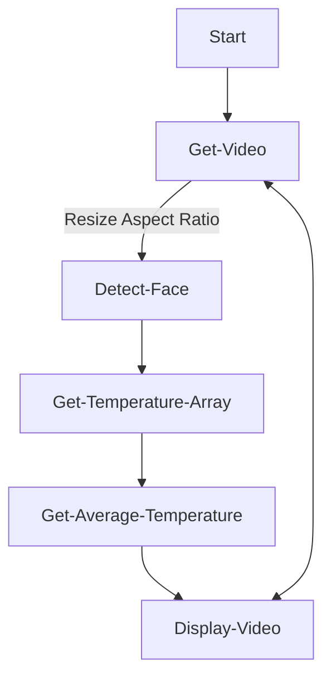

# Thermal Sensor

This is a college project to dectect face of people who are passing by and capture their body temprature

## Prerequisites

- Raspberry Pi 4 with 2+ Ram
- Thermal Imaging Sensor - [MLX90640](https://robu.in/product/waveshare-mlx90640-ir-array-thermal-imaging-camera-32x24-pixels-110-fov/)
- USB Camera - Webcam
- Python 3.9
- OpenCV `pip install opencv-python`
- Thermal Camera Library `pip install adafruit-circuitpython-mlx90640`
- Jumper Wires for connecting raspberry to sensor

## Connections

Raspberry pi and Camera communicates using **i2c protocol**, raspberry pi comes with **i2c** turned off. Turn it on using `sudo raspi-config`


<!-- | Raspberry Pi Pin | Camera Pin | -->
<!-- | ---------------- | ---------- | -->
<!-- | 3.3v             | 3-6v       | -->
<!-- | SDA              | SDA        | -->
<!-- | SCL              | SCL        | -->
<!-- | GND              | GND        | -->

## Functionality



## Face Tracking

### Getting Video from Webcam

For getting video we will be using opencv to capture video live from the webcam and use a face classifier to track the face

```python
import cv2

face_classifier = cv2.CascadeClassifier(
    cv2.data.haarcascades + "haarcascade_frontalface_default.xml"
)

video_capture = cv2.VideoCapture(0)
```

### Mapping Thermal video frame to Webcam Video

Here the aspect ratios of the thermal camera and the webcam can be differerent,
we need to make it both in the same aspect ratio so that its **easier to map the webcam pixels to thermal camera pixels**

| Thermal | Webcam    |
| ------- | --------- |
| 24x32   | 1080x1920 |

> We need to make the camera the same aspect ratio of thermal camera for the best results

```python
def update_webcam_ratio(frame):
    return cv2.resize(frame, (480, 640))
```

### Get the bounding box of the face

```python
def detect_bounding_box(vid):
    gray_image = cv2.cvtColor(vid, cv2.COLOR_BGR2GRAY)
    faces = face_classifier.detectMultiScale(gray_image, 1.1, 5, minSize=(40, 40))
    for (x, y, w, h) in faces:
        cv2.rectangle(vid, (x, y), (x + w, y + h), (0, 255, 0), 4)
    return faces
```

When calling this function it will return an array of

- x
- y
- width
- height

**<span style="color:teal"> x,y values denote the left top corner of the bounding box </span>**

## Getting thermal grid from the sensor

```python
import time,board,busio
import numpy as np
import adafruit_mlx90640

i2c = busio.I2C(board.SCL, board.SDA, frequency=400000) # setup I2C
mlx = adafruit_mlx90640.MLX90640(i2c) # begin MLX90640 with I2C comm
mlx.refresh_rate = adafruit_mlx90640.RefreshRate.REFRESH_2_HZ # set refresh rate

frame = np.zeros((24*32,)) # setup array for storing all 768 temperatures

def get_thermal_grid():
    try:
        mlx.getFrame(frame) # read MLX temperatures into frame var
        break
    except ValueError:
        pass
    return frame
```

### Getting the thermal values

We need to map the values and then take the average of all the grids that are mapped

```python
def get_thermal_value(x, y, w, h):
    grid = get_thermal_grid()
    
```

## Putting it all together

Once we have functions to get the temperature average and face detection we can combine both to get the temperature of the face that is dectected

```python
while True:

    result, video_frame = video_capture.read()
    if result is False:
        break

    frame = update_webcam_ratio(video_frame)
    faces = detect_bounding_box(frame)

    for (x, y, w, h) in faces:
        get_thermal_value(x, y, w, h)

    cv2.imshow( "Thermal body sensor", frame)

    if cv2.waitKey(1) & 0xFF == ord("q"):
        break

video_capture.release()
cv2.destroyAllWindows()
```

## Extra Features for Better Accuracy

- <span style="color:green">Webcam - Thermal Camera Grid Array Aspect Size Matching &rarr; Done</span>
- <span style="color:green">Take Average of the bounding box mapped temperatures &rarr; Done</span>
- <span style="color:orange">Keeping the Webcam close to the Thermal Camera physically &rarr; Comes under Enclosure Design</span>
- <span style="color:red">Calibrating Webcam - Thermal Camera detection position using physical tests &rarr; Not Done</span>

## Links

- [Face Detection with OpenCV](https://www.datacamp.com/tutorial/face-detection-python-opencv)
- [Thermal Camera](https://makersportal.com/blog/2020/6/8/high-resolution-thermal-camera-with-raspberry-pi-and-mlx90640)
